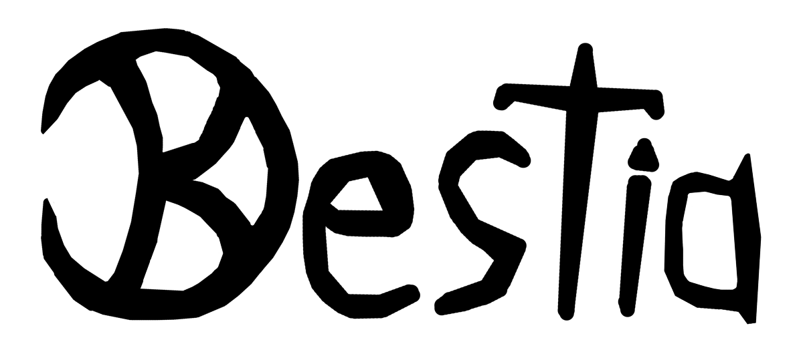

# Bestia Browsergame Client

<p align="center">
  
</p>

[](https://travis-ci.org/tfelix/bestia-client)

This is the client implementation of the [Bestia Browsergame](https://bestia-game.net).

Currently its meant as a development platform and as a small introduction game, thus currently no connection to the server
is established and it is solely a single user game. Later the server support will be added. The game is under active development
but I can only do so much. If you want to help in coding feel free to fork this repo and open some pull requests. :)

Documentation and Game Design goals can be found here in the [Bestia Developers Documentation](https://docs.bestia-game.net/).

You can also get in touch via [Discord](https://discord.gg/zZW8M2S).

## Development

We use [npm](https://www.npmjs.com/) as the build system. In order to build and run the client just checkout the repo
and do:

```bash
npm install && npm run dev
```

inside the main folder.

The game is build using an entity component system. The components are meant to be updated by the server in the future
and are rendered during the update steps in the main loop.

## Contributing

Contribution is quite simple, there is no Contributing Guide yet. The main points are:

* Found a bug? Report it on GitHub Issues and include a code sample.
* Before submitting a Pull Request run your code through TS Lint using our config and keep the coding style already present.

Have an idea which would benefit the game? Cool, tell us via our [Discord Server](https://discord.gg/zZW8M2S).

## Art Assets

The licences of all artwork content used in this project can be found in the [ASSETS.md](ASSETS.md) file.
Great care was taken to only include artworks and assets with permissive licences. If you think there is a problem please
open an issue about it. Without this free artwork this game would not have been possible. Thanks to all artists! Please
check out their great work!

## Created By

TODO